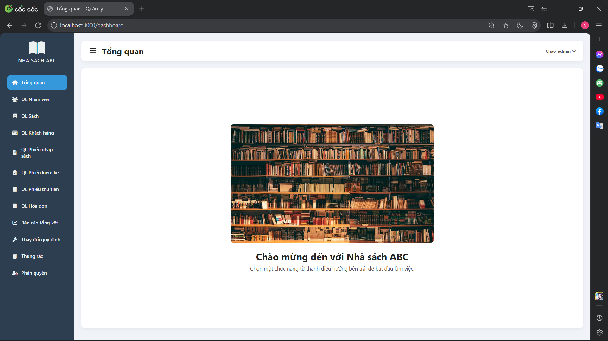

# 📚 Bookstore Management Web Application (Quản Lý Nhà Sách)

Hệ thống quản lý nhà sách trên nền tảng web, giúp chủ nhà sách quản lý hiệu quả kho sách, công nợ khách hàng và tài khoản nhân viên mọi lúc, mọi nơi.

<div align="center">
  
</div>

## 👥 Nhóm thực hiện: 22

**GVHD:** TS. Đỗ Thị Thanh Tuyền  
**Lớp:** SE104.Q13

| STT | Họ và tên            | MSSV     |
| --- | -------------------- | -------- |
| 1   | Phạm Hoàng Lê Nguyên | 22520982 |
| 2   | Nguyễn Khắc Hậu      | 22520410 |
| 3   | Nguyễn Hữu Tính      | 24521792 |
| 4   | Ngô Trung Hiếu       | 22520437 |

---

## 📌 Tính năng (Features)

- **Quản lý tài khoản người dùng**: Phân quyền truy cập cho từng nhân viên.
- **Quản lý nhân viên**: Quản lý thông tin và tài khoản nhân viên.
- **Quản lý nhập sách**: Tạo và theo dõi phiếu nhập sách.
- **Tra cứu sách**: Tìm kiếm và xem thông tin sách trong kho.
- **Quản lý khách hàng**: Theo dõi thông tin khách hàng thành viên, công nợ.
- **Quản lý bán sách**: Lập hóa đơn bán hàng, tự động tính toán tồn kho và công nợ.
- **Thu tiền**: Quản lý việc thu tiền nợ từ khách hàng qua phiếu thu.
- **Báo cáo**: Tự động tạo báo cáo tồn kho và báo cáo công nợ hàng tháng.

---

## 🛠️ Công nghệ sử dụng (Technologies Used)

- **NodeJS**: Môi trường chạy JavaScript phía server.
- **ExpressJS**: Web framework để xây dựng ứng dụng và API.
- **EJS**: Template engine để render giao diện phía server (Server-side Rendering).
- **MySQL**: Hệ quản trị cơ sở dữ liệu quan hệ.
- **Sequelize**: ORM (Object-Relational Mapping) để làm việc với MySQL.
- **Bcrypt**: Mã hóa mật khẩu người dùng.
- **JWT (JSON Web Token)**: Xác thực phiên đăng nhập.

---

## 🚀 Hướng dẫn cài đặt (Getting Started)

### ⚙️ Yêu cầu (Requirements)

- Node.js (v14 trở lên)
- MySQL (đã cài đặt và đang chạy)

### 📦 Các bước cài đặt (Installation Steps)

1. **Clone repository:**

   ```bash
   git clone https://github.com/22520896/BookStoreWeb.git
   cd SE104-qlnhasach
   ```

2. **Cài đặt các thư viện (Dependencies):**

   ```bash
   npm install
   ```

3. **Cấu hình môi trường (.env):**
   Tạo file `.env` tại thư mục gốc và điền thông tin cấu hình database của bạn:

   ```env
   PORT=3000
   DB_HOST=localhost
   DB_USER=root
   DB_PASSWORD=your_password
   DB_NAME=qlnhasach
   DB_PORT=3306
   JWT_SECRET_KEY=your_secret_key
   SEED_ADMIN_USERNAME=admin
   SEED_ADMIN_PASSWORD=123
   ```

4. **Thiết lập Cơ sở dữ liệu:**

   - Tạo database rỗng tên `qlnhasach` trong MySQL (hoặc tên bạn đã đặt trong `.env`).
   - Chạy script để tạo tài khoản Admin mặc định (Script này cũng sẽ tự động đồng bộ bảng nếu chưa có):

   ```bash
   node scripts/seedAdmin.js
   ```

   _(Lưu ý: Lệnh này sẽ tạo tài khoản admin với username/password mặc định là `admin`/`123` nếu chưa tồn tại)_

5. **Khởi chạy ứng dụng:**
   ```bash
   npm start
   ```
   Server sẽ chạy tại: [http://localhost:3000](http://localhost:3000)

### ☑️ Đăng nhập Admin (Admin Login)

Sử dụng tài khoản sau để đăng nhập lần đầu và tạo các tài khoản khác:

- **Username:** `admin`
- **Password:** `123`

_(Tài khoản này được tạo bởi bước chạy `scripts/seedAdmin.js` ở trên)_

---
